<picture>
  <source media="(prefers-color-scheme: dark)" srcset="./banner-dark.svg">
  <source media="(prefers-color-scheme: light)" srcset="./banner-light.svg">
  
</picture>

 

  
  
  

---

## 🌟 About Me

- 🎓 Final-year **BSc (Hons) Information Technology** student at SLIIT, graduating 2026
- 💼 Associate Software Engineer at **Fonix Edu Pvt. Ltd. (Atlas Axillia)**
- 🔭 Working across **React / Next.js / Node.js / Java Spring Boot**
- 🌱 Currently deepening advanced software engineering practice
- 📫 Reach me: **ushanmihiranga2017@gmail.com**
- 🌐 Portfolio: **[ushanmihiranga.com](https://ushanmihiranga.com)**

---

## 🛠️ Tech Arsenal

**Languages**

  
  
  
  

**Frontend**

  
  
  

**Backend**

  
  
  

**Database & Infra**

  
  
  
  

---

## 📊 GitHub Analytics

  
  

 

  

---

## 🐍 Contribution Snake

  <picture>
    <source media="(prefers-color-scheme: dark)" srcset="https://raw.githubusercontent.com/Ushan2001/Ushan2001/output/snake-dark.svg">
    <source media="(prefers-color-scheme: light)" srcset="https://raw.githubusercontent.com/Ushan2001/Ushan2001/output/snake-light.svg">
    
  </picture>

> ⚠️ Don't add this section until the `Generate Snake` Action has run at least once — the `output` branch doesn't exist before that, and the images will 404.

---

## 🌐 Let's Connect

  &nbsp;&nbsp;
  &nbsp;&nbsp;
  &nbsp;&nbsp;
  &nbsp;&nbsp;
  

⚠️ LinkedIn's shield.io logo only renders on brand blue <code>#0A66C2</code> — used above as-is rather than recolored, since on any custom color the glyph silently disappears and only the text remains.

---

  💙 If you like my work, a star means a lot 💙

